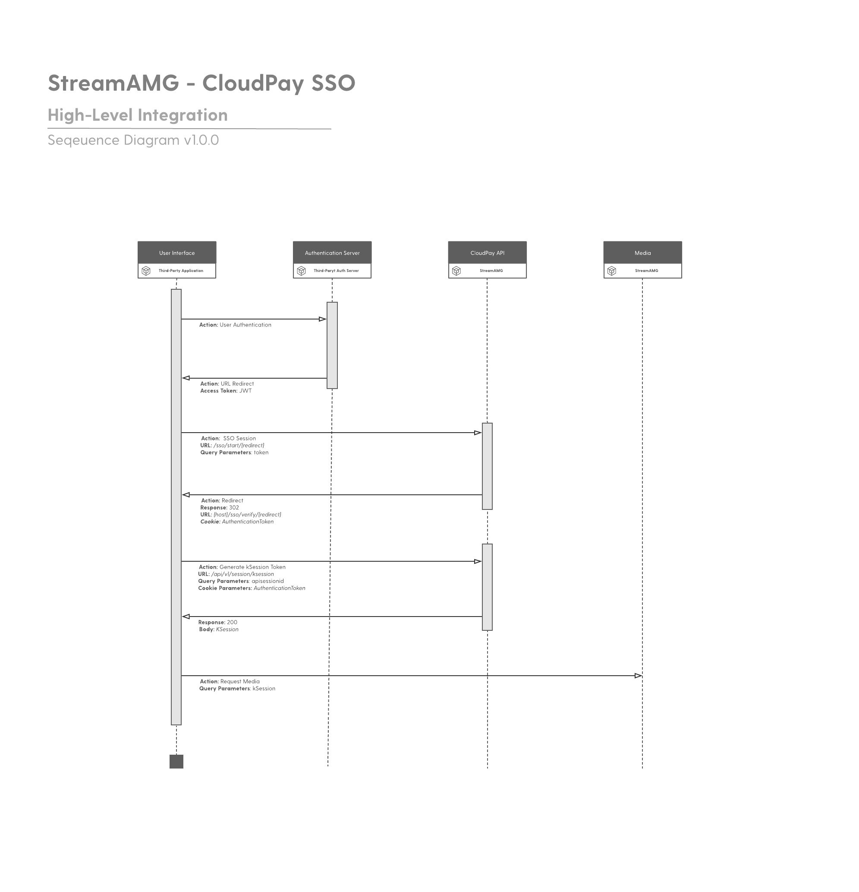

# SSO Integration

The CloudPay API supports Third-Party SSO using JWT and shared secrets.

The following diagram demonstrates a simple integration flow between a third-party application and the CloudPay API.

[Blah](../../reference/CloudPay-API-Specification.yaml/paths/~1api~1v1~1session~1ksession/get)
