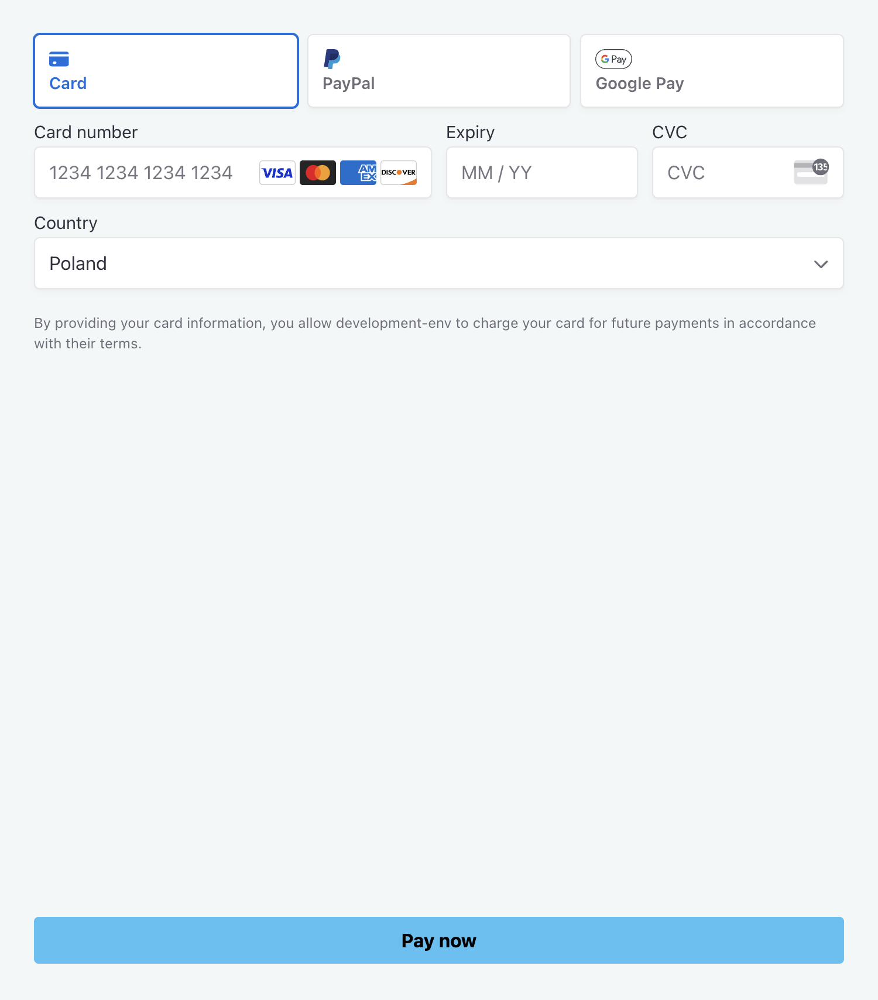
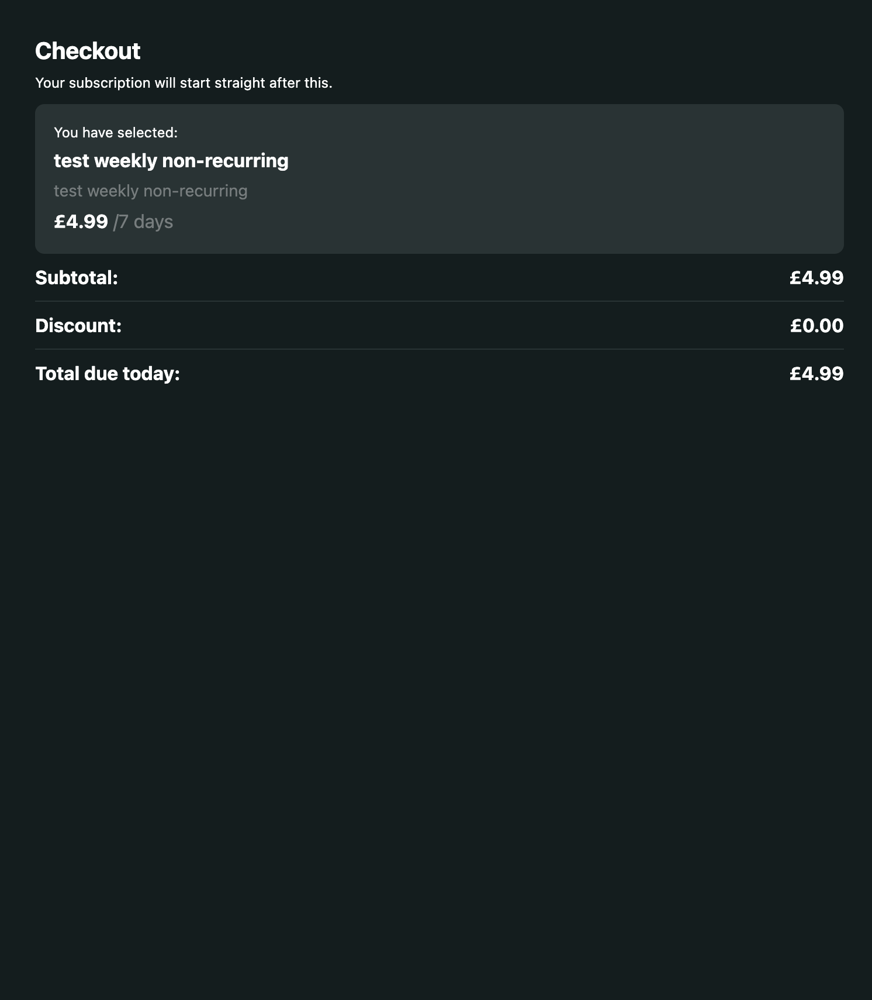

# Checkout Web Components

CloudPay Web Components can be embedded into the web page to create custom checkout pages.

Within CloudPay, there are two web components:

- payment/billing details update web component - provides a payment form for a subscription plan specified or functionality to update user billing details
- payment summary web component - provides information about the subscription plan

## Web Components Source

Web Components are located under the following link: https://components.streamamg.com/checkout/v1/esm/streamamg-checkout.js

It should be included in the **head** tag of the HTML page.

Example:

```html
<head>
  <script
    type="module"
    src="https://components.streamamg.com/checkout/v1/esm/streamamg-checkout.js"
    data-stencil
  ></script>
</head>
```

## Payment / Billing Details Update Web Component

Payment Web Component can be added to the page in the following way:

```html
<streamamg-checkout-payment></streamamg-checkout-payment>
```

For the Payment Web Component to work, you must provide a subscription plan ID, your site URL and the user’s token. Those can be provided in two ways:

1. in checkout page URL via **packageid**, **site** and **apisessionid**/**apijwttoken** query parameters, for example: `https://<your-url>?packageid=<your-subscription-plan-id>&site=<your-site-url>&apisessionid=<user-token>`
2. via the Payment Web Component props, for example:

```html
<streamamg-checkout-payment
  site="your-site-url"
  package-id="your-subscription-plan-id"
  apisessionid="user-token"
></streamamg-checkout-payment>
```

To enable billing details update flow, **is-billing-update** property must be provided to the component. Example:

```html
<streamamg-checkout-payment
  site="your-site-url"
  apisessionid="user-token"
  is-billing-update="true"
></streamamg-checkout-payment>
```

Complete list of properties which can be passed to the Payment Web Component:

1. **return-url** - URL to which the user should be redirected after the payment
2. **successful-payment-redirect-url** - URL to which the user should be redirected in case of a successful payment. It can also be passed as a query **successRedirectUrl** parameter in the URL.
3. **successful-payment-redirect-button-text** - text to show in the action button after the successful payment. Note: button is shown only if **successful-payment-redirect-url** property is provided.
4. **failed-payment-redirect-url** - URL to which the user should be redirected in case of a failed payment. It can also be passed as a query **failedRedirectUrl** parameter in the URL.
5. **failed-payment-redirect-button-text** - text to show in the action button after the failed payment. Note: button is shown only if **failed-payment-redirect-url** property is provided.
6. **error-button-text** - text to show in the action button in case an error occurs during the checkout.
7. **error-message** - message to show the user if an error occurs during the checkout. Defaults to `Error occured! Please report it.`.
8. **rounded-border** - rounded borders for the Web Component wrapper. Defaults to `true`.
9. **background-color** - background colour of the component. Defaults to `#F2F7F7`.
10. **buttons-color** - buttons color. Defaults to `#4AC2F4`.
11. **buttons-text-color** - buttons text colour. Defaults to `#000000`.
12. **text-color** - color of main text.
13. **top-notification-background-color** - the colour of the notification appearing at the top of the component.
14. **top-notification-text-color** - the color of the notification text appearing at the top of the component.
15. **bottom-notification-background-color** - the colour of the notification appearing at the bottom of the component.
16. **bottom-notification-text-color** - the colour of the notification text appearing at the bottom of the component.
17. **main-action-button-text** - text of the main action button at the bottom of the component.

Example of the web component:

<div style="display:flex;justify-content:center">
  
</div>

## Payment Summary Web Component

This Web Component provides information about the subscription plan the user intends to purchase and can be added to the page in the following way:

```html
<streamamg-checkout-payment-summary></streamamg-checkout-payment-summary>
```

For this web component to work, a subscription plan ID and site URL must be provided. This can be done in two ways:

1. in checkout page URL via **packageid** and **site** query parameters, for example: `https://<your-url>?packageid=<your-subscription-plan-id>&site=<your-site-url>`
2. via the Payment Summary Web Component props, for example:

```html
<streamamg-checkout-payment-summary
  site="your-site-url"
  package-id="your-subscription-plan-id"
></streamamg-checkout-payment-summary>
```

Complete list of properties which can be passed to the Payment Summary Web Component:

1. **hide-support-message** - hides the support message appearing at the bottom of the component.
2. **support-email** - email to be shown below the support message at the bottom of the component. It can also be passed as a **supportEmail** query parameter in the URL.
3. **support-message** - support message appearing at the bottom of the component. Defaults to `If you are experiencing any problems with your order please contact us on:`.
4. **error-message** - error message appearing in the components in case of an error. Defaults to `Error occured! Please report it.`.
5. **error-button-text** - text in the button when an error occurs in the component.
6. **error-button-redirect-url** - URL to which the user is redirected after clicking on a button that appears in case of an error in the component.
7. **rounded-border** - rounded borders for the Web Component wrapper. Defaults to `true`.
8. **background-main-color** - main background colour of the component. Defaults to `#111D1E`.
9. **background-secondary-color** - secondary background colour of the component. Defaults to `#263334`.
10. **text-main-color** - main colour for the text in the component.
11. **text-secondary-color** - secondary color for the text in the component. Defaults to `#767D7E`.
12. **error-button-color** - the colour of the button that appears in case of an error in the component.

Example of the web component:

<div style="display:flex;justify-content:center">
  
</div>

## Usage Example

Code example of embedding both web components into the HTML page:

```html
<!DOCTYPE html>
<html>
  <head>
    <title>Payment Page</title>
    <meta name="viewport" content="width=device-width, initial-scale=1" />
    <script
      type="module"
      src="https://components.streamamg.com/checkout/v1/esm/streamamg-checkout.js"
      data-stencil
    ></script>

    <style>
      .wrapper {
        display: flex;
        height: 100vh;

        @media (max-width: 850px) {
          flex-direction: column;
        }
      }

      streamamg-checkout-payment,
      streamamg-checkout-payment-summary {
        flex: 1;
      }
    </style>
  </head>
  <body>
    <div class="wrapper">
      <streamamg-checkout-payment-summary
        rounded-border="false"
      ></streamamg-checkout-payment-summary>
      <streamamg-checkout-payment
        rounded-border="false"
      ></streamamg-checkout-payment>
    </div>
  </body>
</html>
```
